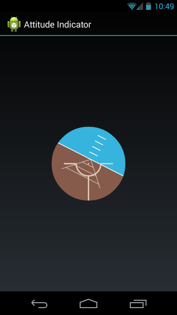

android-rotation-sensor-sample
==============================
This is a sample application that uses the Android rotation sensor and displays the device rotation (pitch/roll) with a custom view (an attitude indicator, aka "artificial horizon").

It shows proper usage of the following Android features:
- Monitoring the rotation vector sensor (but only while the activity is visible).
- Converting the raw rotation matrix to pitch and roll, measured in degrees.
- Adjusting the rotation values based on the device orientation (e.g. portrait vs. landscape).
- Drawing a custom view, including using Porter-Duff transfer mode to create an anti-aliased circle cut-out.

Check out the [arch-components](https://github.com/kplatfoot/android-rotation-sensor-sample/tree/arch-components) branch to see how to use the new [Android Architecture Components](https://developer.android.com/topic/libraries/architecture/index.html) to start/stop the sensor listener automatically at the right time in the activity lifecycle.
